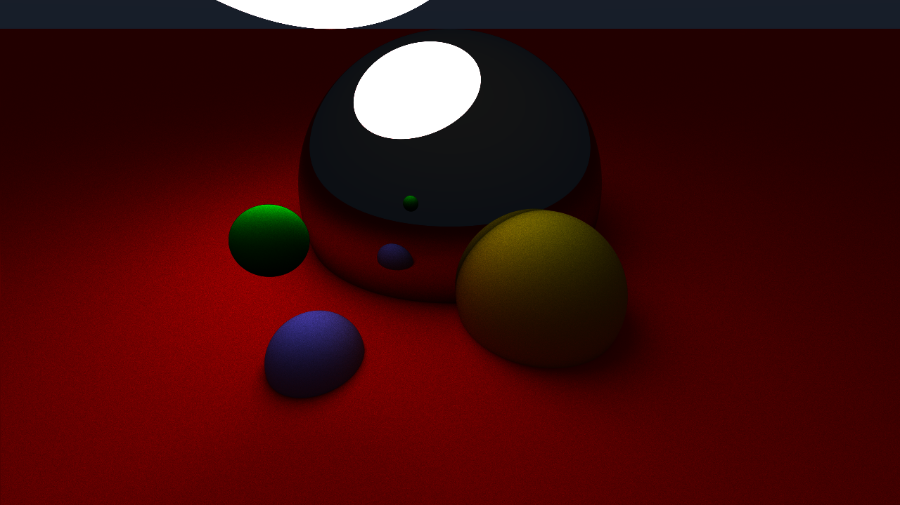

# Rust Raytracer

## Overview

This project is a raytracer written in Rust that supports rendering from .obj files as well as simple geometric shapes such as spheres, planes, and triangles. It is optimized using a Bounding Volume Hierarchy (BVH) for improved performance.

## Examples

Sample scenes are located in the `examples/` directory.

